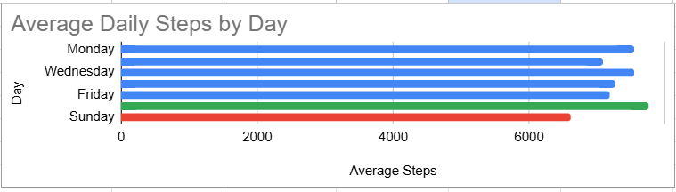
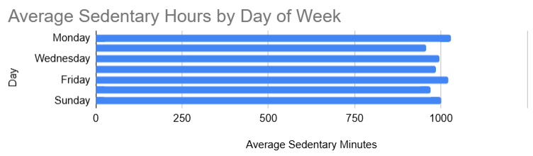
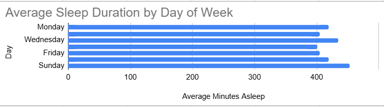

# Bellabeat Data Analysis Case Study
**Google Data Analytics Capstone Project**
Breana Palmer | [LinkedIn](https://www.linkedin.com/in/breana-palmer)

## Overview
Analyzed Fitbit fitness tracker data for 36 users to identify smart 
device usage trends and provide marketing recommendations for 
Bellabeat, a women's health tech company.

## Business Task
Identify trends in smart device usage and apply insights to 
Bellabeat's marketing strategy.

## Data Sources
- FitBit Fitness Tracker Data (Kaggle, CC0 Public Domain)
- dailyActivity_merged: 60 days of data (3/12–5/12), 36 users
- sleepDay_merged: 30 days of data (4/12–5/12), 25 users

## Tools Used
- Google Sheets (data cleaning, analysis, visualization)

## Key Findings
1. Users average 7,280 steps/day — 27% below the CDC recommended 
   10,000 steps
2. Users are sedentary for an average of 16.5 hours per day
3. Saturday is the most active day (7,752 avg steps)
4. Sunday is the least active day (6,607 avg steps)
5. Thursday has the least sleep of any day (6.7 hours avg)
6. Only 25 of 36 users tracked sleep — low feature adoption

## Visualizations

## Recommendations
**1. Sunday Gentle Movement Campaigns**
Users are least active on Sundays. Bellabeat should send light 
activity suggestions through the app on Sunday mornings — walks, 
stretching — that respect the rest day pattern without being 
pushy.

**2. Thursday Sleep Alerts**
Thursday consistently shows the lowest sleep (6.7 hrs). Bellabeat 
should trigger wind-down notifications on Thursday evenings through 
the app and Leaf/Time devices to improve sleep quality mid-week.

**3. Monday Sedentary Break Reminders**
Monday has decent steps but the highest sedentary time (17.2 hrs). 
Bellabeat should introduce hourly movement reminders on Mondays 
to help users break up long periods of inactivity.

**4. Sleep Tracking Feature Marketing**
Only 25 of 36 users tracked sleep, suggesting low awareness or 
adoption of this feature. Bellabeat should highlight sleep 
tracking benefits more prominently in marketing campaigns for 
the Leaf and Time devices.

## Data Limitations
- Sample size of 36 users may not represent all Bellabeat customers
- Sleep data available for only 25 of 36 users
- No demographic data available (age, gender, location)
- Some users recorded 0 steps on certain days, suggesting 
  inconsistent device usage
- Sleep data covers only one 30-day period vs 60 days of 
  activity data
